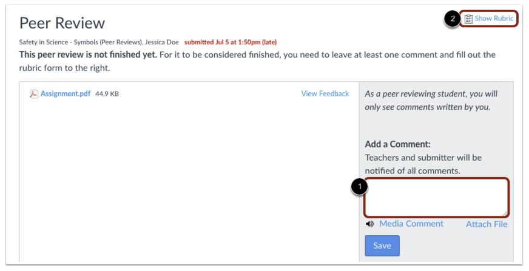

&nbsp;


# CS171 - Homework 4

This homework requires that you have read and programmed along with chapters 7 and 8 in *D3 - Interactive Data Visualization for the Web*.

&nbsp;

## 1) Za'atari Refugee Camp (6 points)

Za’atari is a refugee camp in Jordan that opened in 2011 to host people fleeing from the Syrian civil war. With around 80,000 refugees it is one of the largest UN-supported camps and over the past few years it transformed from a tent camp to a real city with water and sewage systems, markets, coffee shops etc.

*In this homework you will create two charts to present data from Za'atari in a meaningful way.*

### Data

#### Population

As part of this homework assignment we provide a CSV file with population statistics between January 2013 and November 2015. The statistics are based on active registrations in the UNHCR database.

[http://www.cs171.org/2018/assets/scripts/hw4/zaatari-refugee-camp-population.csv](http://www.cs171.org/2018/assets/scripts/hw4/zaatari-refugee-camp-population.csv)

#### Type of Shelter

The REACH initiative and Unicef evaluated the type of shelters in the Za'atari refugee camp. Although, the camp is gradually transforming into a real city, a lot of people still have to live in tents:

> The vast majority of households (79.68%) were recorded as living in caravans. That number was followed by 10.81% of households recorded as living in a combination of tents and caravans, while 9.51% were observed to be living in tents only.

&nbsp;

### Implementation

1. **Download the data**

	Please download the CSV data: [http://www.cs171.org/2018/assets/scripts/hw4/zaatari-refugee-camp-population.csv](http://www.cs171.org/2018/assets/scripts/hw4/zaatari-refugee-camp-population.csv)

2. **Set up a new D3 project and create a two-column layout in your HTML file**
	During the course of this homework you will add an area chart to the left column and a bar chart to the right column.
	
	
	
3. **Load the CSV file and prepare the data for the area chart**
	
	The *dates* are loaded as string values. Similar to numeric values (e.g. ```d.price = +d.price```) you have to convert these values. You will need *Date Objects* to create flexible *time scales* later.
	
	*This website should help you to convert the data into the right format: [https://github.com/d3/d3-time-format/blob/master/README.md](https://github.com/d3/d3-time-format/blob/master/README.md). Make sure to test your results before continuing.*

4. **From now on, your charts should implement the D3 margin convention**

	Create ```margin```, ```height```, and ```width``` variables and append a new SVG drawing space for the area chart to the HTML document via JavaScript.

5. **Area chart: Before you create the actual area chart, create linear scales for the x- and y-axes**

	Use the ***D3 time scale function*** for the x-axis.  It is an extension of *d3.scaleLinear()* that uses JS date objects as the domain representation.

	*Read more about D3's time scales: [https://github.com/d3/d3-scale/blob/master/README.md#time-scales](https://github.com/d3/d3-scale/blob/master/README.md#time-scales). You can (and should) always google for additional examples, if you are still unclear on the usage of D3 elements we require you to include.*

6. **Area chart: Map the population data to the area (using SVG path)**

	*Compared to a simple line chart you should fill the whole area between the data points and the x-axis.*
	
	To create an area chart, follow the steps below:
	
	a. Define a function that generates the area:
	
	See [https://github.com/d3/d3-shape/blob/master/README.md#areas](https://github.com/d3/d3-shape/blob/master/README.md#areas) (```d3.area()```) for details.
	
	b. Draw the area (using an SVG path element)
	
	```javascript
	var path = svg.append("path")
      .datum(data)
      .attr("class", "area")
      .attr("d", area);
	```
	
	c. Change the style with CSS 
	
	If any of these steps are unclear, study some D3 area chart examples online. Make sure you understand the code before you implement it yourself! 
	
	d. Bonus (optional): Render the actual boundary (upper line of the area chart) as line, with different visual properties.

7. **Area chart: Append the x- and y-axes and add a chart title**

	From now on, we expect that you will always label your charts, display meaningful axes, and provide a legend if necessary. Also, make sure your axes start at appropriate values.
	In data visualization we aim to create meaningful, easy-to-understand visualizations to provide insight into the data. Missing labels or axes are often a main cause for misunderstanding data!
	
	* Format the labeling of the x-axis to display the month and year in text format (e.g. April 2013). 
	* Make sure that the labels don't overlap each other, by rotating the text labels of the x-axis. 
	
	
8. **Create a compound JS data structure to store information about the shelter types** 

	Store the information you have about the different shelter types in your own data structure. (As a reminder, 79.68% of households were recorded as living in caravans. 10.81% of households live in a combination of tents and caravans, while 9.51% live in tents only.)

	* Store the *type of shelter* and *percentage values*.
	* You will have to use your data structure for your bar chart afterwards, so make sure that it is as simple and efficient as possible. The actual implementation is up to you.

9. **Create a vertical bar chart for the camp's three shelter types**

	* Append a new SVG drawing area for the bar chart (using D3 margin conventions) to the right column of your webpage.
	* Map the data from your new dataset to SVG rectangles to create a vertical bar chart (refer to the screenshot in Section Implementation.1 for how it should look). The y-axis represents the percentage of people living in one of the three shelter types.
	* Usa a linear scale for the y axis. 
	* For the x dimension you may choose to use either an ordinal scale or no explicit D3 scale function, as there are only 3 categories. (Note, however, that in one of the next steps you will have to add labels for each bar. Your scale implementation here affect the way you add labels later.)
	* Add a chart title.

10. **Bar chart: Draw x- and y-axes**

	*The ticks of the y-axis should be formatted as percentages.*
	
	[https://github.com/d3/d3-axis/blob/master/README.md](https://github.com/d3/d3-axis/blob/master/README.md)

11. **Bar chart: Append labels at the top of each bar to indicate the actual percentages**

	* Each bar should have a label to indicate the percentage, directly above the bar.
	* Each bar should also have a label with the name of the shelter type. This can be done either by using a categorical x axis, or by manually adding text labels.

12. **Create dynamic tooltips for your area chart**

	

	*There are many different ways to include tooltips. This tutorial shows one way and can be used as a guide - but feel free to experiment! Also note that this tutorial still uses an older version of D3 - so you would have to adapt it to work with version 4.*
	
	[http://www.d3noob.org/2014/07/my-favourite-tooltip-method-for-line.html](http://www.d3noob.org/2014/07/my-favourite-tooltip-method-for-line.html)
	
	Make sure the tooltip shows the camp's population for the current mouse position, as shown in the above animation.
	
	Note: This step is relatively complex, compared to the earlier steps. Make sure you understand and play around with the example code first! Then, add individual elements step-by-step and make sure they are working before adding on more elements.

13. **Use CSS to style the webpage**
	
	*Spacing between charts, font size, color scheme, ...*
	
	This is your space to be creative! Please use at least 3 CSS styles, and keep the design guidelines you have learned so far in lecture in mind. But you don't need to go overboard. (Required are 3 different CSS styles)

&nbsp;

Congratulations on finishing the D3 part of your homework! Up until now, all your visualizations have been static (i.e., the initial visualization did not change after first rendering). Over the next couple of weeks you will learn how to dynamically update visualizations, and how to create dynamic transitions. You will also learn how to link two or more visualizations together, so that the interaction in one view will automatically trigger an update of the second view! 
	
## 2) Design Creation (2 points)

In the next part of this homework we want you to go one step back and focus on the design creation. The process of creating and analyzing multiple sketches is crucial before you start with the implementation.

We provide a new dataset which you can download here (or see table below): 
[http://www.cs171.org/2018/assets/scripts/hw4/gii-data.csv](http://www.cs171.org/2018/assets/scripts/hw4/gii-data.csv)

*The sketches should be hand-drawn! They should communicate your idea and the rough concept of how the visualization should look like. Even if we give you a table with detailed information, you should not draw all the exact data points. Perfection should not be the goal of these sketches.*


### Instructions

1. **Formulate three questions that you would like to answer regarding the dataset**

	- Submit these questions with your sketches.

2. **To answer *each* question, create a sketch of a visualization. Each sketch has to answer at least one of the questions you identified above. In total, you should hand in at least three sketches that fulfill the following requirements:**

	- All sketches have to show at least two of the data dimensions. One of these dimensions has to be nominal.
	- At least one sketch should encode **all** data dimensions. At the end you should have at least three different sketches. (Just showing the data table does not count as sketch.)

3. **For *each* of your sketches describe...**
	
	- which visual channels do you use for which dimension
	- the Gestalt principles that you use 
	- which question this sketch is trying to answer, and how
	
 
4. **Scan your sketches and create a PDF with all your results**


### Data

| Country            | Continent     | Human Development | Gender Inequality Index | Share of seats in parliament (% held by women) |
|--------------------|---------------|-------------------|-------------------------|------------------------------------------------|
| United States      | North America | very high         | 0.28                    | 19.4                                           |
| Sweden             | Europe        | very high         | 0.055                   | 43.6                                           |
| Qatar              | Asia          | very high         | 0.524                   | 0                                              |
| Mozambique         | Africa        | low               | 0.591                   | 39.6                                           |
| Germany            | Europe        | very high         | 0.041                   | 36.9                                           |
| Saudi Arabia       | Asia          | very high         | 0.284                   | 19.9                                           |
| Argentina          | South America | very high         | 0.376                   | 36.8                                           |
| Russian Federation | Asia          | high              | 0.276                   | 14.5                                           |
| India              | Asia          | medium            | 0.563                   | 12.2                                           |
| China              | Asia          | high              | 0.191                   | 23.6                                           |
| Egypt              | Africa        | medium            | 0.573                   | 2.2                                            |
| Maldives           | Asia          | high              | 0.243                   | 5.9                                            |
| Australia          | Oceania       | very high         | 0.11                    | 30.5                                           |
| Switzerland        | Europe        | very high         | 0.028                   | 28.5                                           |
| Cuba               | North America | high              | 0.356                   | 48.9                                           |


> **Gender Inequality Index (GII)**
> 
> "Gender inequality remains a major barrier to human development. Girls and women have made major strides since 1990, but they have not yet gained gender equity. The disadvantages facing women and girls are a major source of inequality. All too often, women and girls are discriminated against in health, education, political representation, labour market, etc. — with negative repercussions for development of their capabilities and their freedom of choice."
> 
> "The GII is an inequality index. It measures gender inequalities in three important aspects of human development—reproductive health, measured by maternal mortality ratio and adolescent birth rates; empowerment, measured by proportion of parliamentary seats occupied by females and proportion of adult females and males aged 25 years and older with at least some secondary education; and economic status, expressed as labour market participation and measured by labour force participation rate of female and male populations aged 15 years and older."
> 
> *- United Nations Development Programm*


## 3) Design Critique (2 points)

In this part of the homework you will perform a visualization critique on the HW3 sketches of one of your peers. You will give this feedback via the peer review feature of Canvas. After giving the feedback, you will submit only the email address of the student you critiqued as part of this homework.

1. **One random classmate will be assigned to you**

To ensure that each student gets valid feedback, we will randomly assign students with each other.

2. **Provide a constructive design critique for the redesign sketch that the student picked as the best solution (HW3 redesign, question 2).**

	Answer the following questions in the peer feedback:
	
	- What visual channels are used to encode the data? 
	- Is the encoding effective based on the ranking of visual features?
	- Do you like or not like the visualization? Why?
	- What could be improved?


	*Please be constructive, polite and honest - you give feedback to the student directly. Feedback is only helpful if it addresses problems but also gives credit where credit is due. Take a look at this [link](http://www.aiga.org/how-to-survive-a-critique/) on how to give constructive peer feedback.*

	> #### How to give peer feedback on Canvas
	>
	> *(1) Open the peer review link for HW 3 under your To Do list on Canvas. It should appear similar to the screenshot below, with the link showing "Peer Review for HW 3".*
	>
	> 
	>
	> *(2) Download the zip submission, unzip, and look for the redesign sketch. If the student followed our recommended folder structure, it should be under the hw/design/ folder. Submit your review as a comment.*
	>
	> 

3. **To document your feedback, copy the email address of the student who's visulization you critiqued into the PDF from part 2 (design creation)**


## 4) Bonus Task (1 point)

Please make sure to finish all previous tasks completely before you start with the bonus activity. Extra credit is only given if the rest of the homework has been completed and the full possible points have been received. This task is intended for those of you who have already more experience with JS libraries.

At this point your webpage should contain a static bar chart with shelter types and an area chart showing the total camp population from 2013 to 2015. You have also implemented dynamic tooltips for the area chart to show individual values when the mouse pointer is moved over the chart.

In this bonus activity you should further extend your area chart and color two specified regions differently. Assume that the Za'atari refugee camp had a planned capacity of 100,000 people. This threshold was exceeded quickly. Show it in your visualization by coloring the critical region (> 100,000) and by adding a line at this point:


You can either draw two paths (d3 area function) and clip the defined regions or you can use one path with a *gradient fill*.

Of course the mouse pointer and the dynamic tooltips should remain unchanged.


## 5) Submit Homework in Canvas

Submission instructions:

1. Use the following recommended folder structure:

```
/submission_FirstnameLastname	
	hw/
	    implementation/ ...folder for your code
   	        index.html
	        css/ 		...folder with all CSS files
	        js/ 		...folder with all JavaScript files
	    design/         ...folder for your sketches
	        ...
	lab/
	    ...
```

2. Make sure to keep the overall size of your submission under 5MB! Sketches don't have to be in the highest resolution, but should still be readable.

3. Upload a single .zip file.

4. Also submit the completed lab (activity I, II, and III) on Canvas.

**Congratulations for finishing Homework 4! See you in class!**