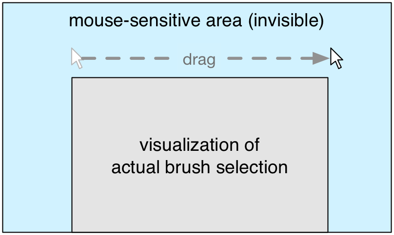

&nbsp;

# Lab 9

### Learning Objectives

- Know how to integrate a sophisticated *event handling mechanism* to connect multiple visualizations components and UI elements with each other
- Get more experience with *brushing* and *zooming* in D3
- Get a better understanding of *system design* and *code structure* in order to be able to create larger visualization system


### Prerequisites

- You have watched the following videos:
	- jQuery Tutorial #1 - [https://www.youtube.com/watch?v=hMxGhHNOkCU](https://www.youtube.com/watch?v=hMxGhHNOkCU)
	- jQuery Tutorial #2 - [https://www.youtube.com/watch?v=G-POtu9J-m4](https://www.youtube.com/watch?v=G-POtu9J-m4)
	- *[Optional]* jQuery Tutorial #3 - [https://www.youtube.com/watch?v=Cc3K2jDdKTo](https://www.youtube.com/watch?v=Cc3K2jDdKTo)
	- *[Optional]* jQuery Tutorial #4 - [https://www.youtube.com/watch?v=LYKRkHSLE2E](https://www.youtube.com/watch?v=LYKRkHSLE2E)

- You already have an overview of the *My World 2015* project and the datasets we are going to use today ([http://cs171.org/2018/assets/material/cs171-lab9-reading.pdf](http://cs171.org/2018/assets/material/cs171-lab9-reading.pdf))


In the last weeks you have learned how to implement common visualization types in D3. You have learned how to use brushing and you have linked multiple reusable views with each other by using a very basic event handler (global *brush* function). This lab is built on all these fundamentals. You will learn how to structure a larger visualization system and how to integrate an event handling mechanism, which you will very likely need for your final projects. Due to the extensive example, which is necessary to demonstrate how to structure larger systems, we will provide a template with many completed parts. Your main tasks will focus on the structure, the interactions and the event handling components. However, please make sure that you understand the code in the provided templates, and take your time to read through it!


## United Nations - My World 2015

You will build a system that allows interactive selection of time slices of the poll data from the years 2012 and 2013. For the selected time period, the visualization will show the amount of votes per priority/choice from the poll data in addition to a histogram of participant's age for the given selection.

*Preview of the final system:*


### Data

We have already aggregated and transformed the original datasets to make the data format a better fit to the tasks we want to perform. You should know the rough structure and the contained information from the pre-reading.


- ```perDayData.json```
- ```myWorldFields.json``` *(= metadata about the 15 priorities)*


### Template

This lab combines many concepts that we have introduced during the last weeks and gives you all the tools you need to build a larger visualization system on the web. The provided template is similar to the template from lab 6 where we have worked with multiple coordinated views for the first time. It is based on Bootstrap and it contains a basic HTML structure, some CSS rules and pieces of JS code.

The controller and the data loading scripts are in the ```main.js``` file.

You will implement the visualizations again as reusable components (JS objects) in separate files:

- ```agevis.js```
- ```countvis.js```
- ```priovis.js```

We have also included all the other usual files (index.html, style.css, etc) and libraries (Bootstrap, D3, jQuery), like in our previous labs and homeworks.

## Implementation

The following image shows the visualization components of the system we are going to build. The core of the webpage and the main interaction point is *CountVis* (```countvis.js```). The area chart in the second row (*AgeVis*) gives an overview of the participants age and the bar chart shows the number of votes for each priority. If you consider this as a focus+context visualization, the *CountVis* component provides the context and the other two views display detailed information for the selected time frame.


### Data loading and pre-processing

When you start to work on your final project or on other larger visualization systems you will probably find out that the data is not every time available in the desired format. Sometimes you have to transpose the data, aggregate values or combine datasets from multiple sources. In the course of the last weeks you have already learned how to handle most of it. In the following we want to introduce a new D3 technique that we have used in the *My World 2015* example and that helps you to extract/generate data.

We can use the ```d3.range()``` function to generate a range of numeric values:

```javascript
var arithmeticProgression = d3.range(0,10);
arithmeticProgression    // Returns: [0, 1, 2, 3, 4, 5, 6, 7, 8, 9]
```

(The arguments specify the *start* and *end* of our sequence. If you start with 0 the second parameter is equal to the length of the array. You can test some examples in your web console.)

And we can use ```map()``` to execute a custom function for each value in a given array:

```javascript
var result = arithmeticProgression.map(function(d){
	return d * 2;
});
result    // Returns: [0, 2, 4, 6, 8, 10, 12, 14, 16, 18]
```

Finally, the combination of these methods allows us to generate arrays with custom values:

```javascript
var twelveZeros = d3.range(0,12).map(function(){
	return 0;
});
twelveZeros     // Returns: [0, 0, 0, 0, 0, 0, 0, 0, 0, 0, 0, 0]
```

Or to transform data that is stored in key-value format to arrays:

```javascript
var data = {
	"sum-0": 10,
	"sum-1": 20,
	"sum-2": 30,
	"sum-3": 40
};

var result = d3.range(0,4).map(function(counter){
	return data["sum-" + counter];
});

result      // Returns: [10, 20, 30, 40]
```

----

#### Activity I - Load the template and complete the charts

1. **Download the template**

	[http://www.cs171.org/2018/assets/scripts/lab9/template.zip](http://www.cs171.org/2018/assets/scripts/lab9/template.zip)

2. **Open the file ```main.js``` and get an overview of the data loading and cleaning procedure**

	At the beginning of the file we have used *queue.js* to load the two datasets asynchronously.

	If you have a look at the function ```createVis()``` you will recognize the mentioned technique ```d3.range(n).map()```. We use it to clean the main dataset ```perDayData.json``` and to prepare it for the use in the visualization objects.

	The basic implementation of the CountVis object is completed too. You should already know how to draw an are chart in D3. If you open ```index.html``` in your web browser you should see the graph showing the number of votes for a specific time period.

3. **Implement the *AgeVis* component** (the second visualization)

	The second area chart visualizes the number of votes per age. We have also provided many code snippets in the file ```agevis.js``` but one further step is required.

	The dataset ```perDayData.json``` currently groups all votes per day and age, but for this view we have to aggregate the values for each age group without the temporal information.

	*Example:*

	```javascript
	// Raw data - aggregated by date
	var days = [
		{ "date": "2017-08-07", "cat-0": 1, "cat-1": 4, "cat-2": 3 },
		{ "date": "2017-08-08", "cat-0": 2, "cat-1": 0, "cat-2": 1 },
		{ "date": "2017-08-09", "cat-0": 7, "cat-1": 11, "cat-2": 1 }
	];

	// Result array should be aggregated by category (cat-0 to cat-2)
	// Prepare empty array
	var countPerCategory = d3.range(0,3).map(function() {
		return 0;
	});

	// Aggegrate by category:
	// Iterate over each day and fill array
	days.forEach(function(day){
		d3.range(0,3).forEach(function(i){
			countPerCategory[i] += day["cat-" + i];
		});
	});

	countPerCategory    // Returns: [10, 15, 5]
	```

	Read the above code snipped carefully, and understand what it is doing before you continue!
	
	→ In ```main.js```: Create an instance of the AgeVis component. The code snippet is already there, just remove the comment. Note: Since the AgeVis component is not fully implemented yet, you might get errors or warnings when instancing that component.
	
	→ In ```agevis.js```: Adopt this code snippet for the aggregation of votes, following our visualization pipeline, in the ```wrangleData()``` function. The My World 2015 project collects votes for all ages <= 99. You can use the web console in between to debug your code and to better understand the data transformation.


	→ Open the webpage in your browser! If everything worked, you should see both area charts. If you get an error message in the web console you should fix it before going further.


4. **Implement the *PrioVis* component**

	The bar chart (```priovis.js```) shows how many people voted (y-axis) for which of the 15 priorities (x-axis). Similar to the *AgeVis* component, the data is grouped by day and you have to aggregate it first.

	→ Create an instance of the PrioVis component in ```main.js```. Pay attention what parameters PrioVis expects at creation.
	
	→ Aggregate the votes for each priority in the ```wrangleData()``` function (basically the same procedure as before in AgeVis, but this time you aggregate over priorities instead of ages).

	→ Open the webpage in your browser and check if all three charts are visible


5. **Update the x-axis of the bar chart**

	If you have finished all the previous steps, the user can see a bar chart with the number of votes for each priority on your webpage. Unfortunately, the numbers 0-14 have little meaning to the user and it would be helpful if you could display the names of the priorities on the x-axis instead.

	You can modify the axis text after calling the axis component, like in this example, where we add the string "Cat-" as a prefix for every y-axis label:

	```javascript
	svg.select(".y-axis")
		.call(yAxis)
		.selectAll("text")
			.text(function(d){
				return "Cat-" + d;
			});
	```

	(Alternatively, you can use D3's ```tickFormat``` function)

	→ In ```updateVis()```: Modify the code where the x-axis is being called, to adjust the labels (```.text```) of the x-axis. Use the values from the dataset *metaData* and display the full title for each priority. 
	
	*Hint:* We already included the second dataset in the object constructor function and, due to the length of the titles, we rotated all x-axis labels by 45 degrees. You can use ```console.log(vis.metaData)``` to find out how to access the data you are looking for.)

----

### Event handling

At the moment, the views display votes for the full time period (whole dataset) and they are not linked to each other.

Similar to lab 6 we will use *brushing* to enable the user to select a specific time frame and to filter the votes by time. *CountVis* is the main interaction point and the other two charts are getting updated accordingly.

To connect the three views we will make use of an event handler. Instead of being directly connected with each other, the views talk to each other via a mediator. A popular analogy of this principle is the Twitter service. For example, Homer follows (binds himself to) Bart. Once he has done that, Homer will be notified every time Bart tweets (triggers a message event), Homer and all other followers get notified. However, Bart is only notified of Homer's tweets when he also explicitly subscribes to Homer. Applied to our visualizations that can be imagined as:


#### Brushing (review)

In D3, a brush is an interactive area where clicking and dragging on the mouse is interpreted as a selection of a range. The range selection can be used to make changes to the visualization. The extent of the selection is shown as illustrated in the following image. Note that the area where you can click and drag to initiate a brush is shown in blue, while the visible representation of the brush is shown in grey.




There are three types of D3 brushes: ```brushX```, ```brushY```, and ```brush```. You have to initialize the brush and assign an extent, which (most of the time) is the same size as the visualization itself.

The property **```on```** must be used to set an event listener, whereby you can choose between three different events:

- ```start``` - on mousedown
- ```brush``` - on mousemove, if the brush selection has changed
- ```end``` - on mouseup

```javascript
// Initialize time scale (x-axis)
var x = d3.scaleTime()
	.range([0, width])
	.domain(d3.extent(displayData, function(d) { return d.Year; }));

// Initialize brush
var brush = d3.brushX()
	.on("brush", brushed)
	.extent([[0,0],[width,height]]);

// Append brush
svg.append("g")
	.attr("class", "brush")
	.call(brush);
```

Up to now we have always created a global function ```brushed()``` in the ```main.js``` file that was triggered every time when the brush region changed. In this file we can access and update all the other views. Although this solution is easy to understand and can be implemented quickly, it is not ideal for larger visualization systems. In this lab we will interchange it with an event handler.

#### Event handler

We will make use of the event handling capabilities of *jQuery* and we are especially interested in these two functions:

- ```.bind(eventType, handler)``` - binds the function ```handler``` to an event (the event is specified as the name of the event, as a string ```eventType```). That means, when a certain event occurs (e.g., ```bartTweeted```) the handler function (e.g. ```readBartsTweet```) is being called.
- ```.trigger(eventType, extraParameters)``` - triggers an event ```eventType``` and calls all functions that are bound to this event. Here, eventType is a string (see above) and extraParameter is an object representing extra data, like e.g., the current location of Bart.

The event handler must be initialized in the controller (```main.js```). We have prepared a small example for a better understanding:

```javascript
// 1. Create event handler
var MyEventHandler = {};

// 2. Create visualization instances
var contextVis = new ContextVis("context-vis", data, MyEventHandler);
var focusVis = new FocusVis("focus-vis", data);
```

In the brushing component (```contextvis.js```) we can listen to changes and trigger the event handler accordingly:

```javascript
var brush = d3.brushX()
	.extent([[0,0],[width, height]])
	.on("brush", function(){
		// User just selected a specific region
		vis.currentBrushRegion = d3.event.selection;
		vis.currentBrushRegion = vis.currentBrushRegion.map(x.invert);
		
		// 3. Trigger the event 'selectionChanged' of our event handler
		$(myEventHandler).trigger("selectionChanged", vis.currentBrushRegion);
	});
```

*Hint:* Use the console to see what ```vis.currentBrushRegion``` is - you may need to convert it into its corresponding range in your domain, e.g., using ```x.invert```. 

And back in the controller we can bind our event handler to other visualization components:

```javascript
// 4. Bind event handler
// when 'selectionChanged' is triggered, specified function is called
$(MyEventHandler).bind("selectionChanged", function(event, rangeStart, rangeEnd){
	focusVis.onSelectionChange(rangeStart, rangeEnd);
});
```

In the final step (i.e., in the function that we call from our event handler, after ```selectionChanged``` has been triggered) we just filter the data based on the brush and update the visualization component (```focusvis.js```):

```javascript
FocusVis.prototype.onSelectionChange = function(selectionStart, selectionEnd){
	var vis = this;

	// vis.filteredData = vis.data.filter(function(d){
	// ...

	vis.wrangleData();
}
```

Now it's your turn to implement event handling! Please get started on Activity II.


----

#### Activity II - Implement *brushing* and an *event handling* mechanism

*Hint:* For the next steps, keep in mind, that whenever we are inside an object (e.g., Countvis), to use the ```this``` keyword for storing or accessing variables of that class. More importantly, we usually call ```vis = this```, in that case use ```vis.``` to access object variables.

1. **Initialize the event handler and pass it to the *CountVis* object** (in ```main.js```). Make sure that you store the event handler in constructor of ```CountVis```.

2. **Initialize the *brush* component, append it to your SVG area (in ```initVis()```) and call it (in ```updateVis()```)** (all in ```countvis.js```)

3. **Trigger the event handler whenever the user changes the brush region** (in ```initVis()``` in ```countvis.js```)

4. **Bind the event handler** (in ```main.js```). Start by binding the event to an anonymous function that gives you console output whenever you brush. Once that is working, when handling the event in the anonymous function, you should update the *AgeVis* and *PrioVis* component by calling the ```onSelectionChange()``` functions in both compontents. (See next point).

5. **Implement the *onSelectionChange()* functions in**```agevis.js``` **and** ```priovis.js```

	These functions get called when the user changes the brush selection. You should filter the dataset (new start and end date) and update the visual elements in the SVG areas. Keep in mind that you need to store the original, unfiltered dataset.

	Open the webpage in your browser. You should be able to select a brush region in the context visualization and the other two visualizations should be updated automatically.

6. **Show the selected time period**

	→ Create additional elements in the ```index.html``` file to display the current time period. At the beginning it should cover the whole dataset and after the user changes the selection (brush) the dates should be updated immediately.

	You can implement the function to update these text labels as part of the *CountVis* object. Similar to *AgeVis* or *PrioVis* in a new function, e.g. ```onSelectionChange()```. 
	
	*Hint:* One line in that function could look something like this ```d3.select("#time-period-min").text(dateFormatter(rangeStart));```)

	*Example how it can look like:*

	

----

### D3 Zoom Behavior

Besides many drawing functionalities, the D3 library allows us to include interaction mechanisms into our visualizations. We can create event listeners for clicks and mouse gestures in order to improve the usability and to keep users engaged. In the previous examples we have used input fields and select-boxes to filter our datasets, we have implemented functions to change the sorting of SVG elements and most recently we have integrated D3's brushing component to select specific regions visually. Now we will introduce another interaction mechanism in D3 - the zoom behavior.

Panning & zooming in visualizations allow users to move in and narrow down on the visible data points or to move out and to get a broader view of the data. The focus+context visualization, that you have implemented in lab 6, was basically also a certain type of zooming behavior, with the difference that we have used an additional chart for the interaction. However, in many scenarios it is useful to zoom in directly (scroll on zoom) on the x-axis, y-axis or on both simultaneously.

*Example:*

```javascript
// Original scale
var xScaleOrig = 1.0;

// Initialize the zoom component
var zoom = d3.zoom()

	// Subsequently, you can listen to all zooming events
	.on("zoom", function(){
		// Do something
	})

	// Specify the zoom scale's allowed range
	.scaleExtent([1,20]);

// Get the modified version of the scale when zooming.
// You have to make sure you use the modified scale to update your visualization.
var xScaleModified = d3.event.transform.rescaleX(xScaleOrig);
```

Similar to axes or the brush component you have to apply the behavior to selected elements using ```selection.call()```. Usually  you would draw an invisible rectangle over the full height and width of the visualization and bind the zoom behavior to it. But if you are additionally using the brush component you should apply it directly to it:

```javascript
var brushGroup = svg.select(".brush")
brushGroup.call(zoom);
```

Further details:

- The D3 zoom component actually consists of the zoom and pan behavior. The panning behavior, that makes you able to pan along the x and y axis, is needed when you want to zoom in to a specific point
- You can also define an y-scale for the zoom
- If you don't specify the attribute ```scaleExtent()```, the zoom component will default to [0, *Infinity*].

You can read more about D3's zooming component here: [https://github.com/d3/d3-zoom/blob/master/README.md](https://github.com/d3/d3-zoom/blob/master/README.md)

----

#### Activity III - Make the *CountVis* component zoomable along the x-axis

*Preview:*


1. **Add the zoom component and initialize the D3 zoom behavior**

	→ You should first save the original scale in a variable. 
	
	→ Initialize the zoom component and store it in the variable ```vis.zoom```. Define the zoom extent, and register the zoom event listener in ```.on("zoom", zoomFunction)```.
	
	→ Set the zoom extent to 1-20
	
2. **Implement ```zoomFunction()``` to handle zoom events**
	
	Your event listener is called every time the user zooms in or out. In your event listener you should:
	
	→ Apply the zoom to the x-axis scale.
	You can use something like the following:

	```javascript
	var xScaleModified = d3.event.transform.rescaleX(xScaleOrig);
	```
	But make sure you use the scales you have defined (e.g., vis.x, vis.xOrig)
	
	→ Call the ```updateVis()``` function. 
	
	→ You should check if the brush component is active (user selected a specific time frame) and update it using ```brush.move``` before calling the ```updateVis()``` function. Otherwise the user zooms on the x-axis and the brush window remains unchanged.

	```javascript
	if(vis.currentBrushRegion) {
		vis.brushGroup.call(vis.brush.move, vis.currentBrushRegion.map(vis.x));
	}
	```


3. **Activate the zoom behavior**

	→ Apply the zoom behavior to your brush by using vis.brushGroup.call()

	→ Disable clicking and dragging events for the zoom

	Due to the use of *brushing* we have to deal with a special case. We already use the clicking and dragging events for specifying the size of the brush window. Therefore we can't use panning and we have to block these events in the zoom component:

	```javascript
	selection.call(zoom)
		.on("mousedown.zoom", null)
		.on("touchstart.zoom", null);
	```

	For testing you can omit this and open the webpage in your browser. You will notice the *bumpy* interaction.

4. **Clip all elements that go beyond the borders of your chart area**

	At the moment we don't filter our data while zooming and we also don't draw a different path. We are just modifying the domain of our x-axis and determine thereby which part is visible and which not. This means that parts of our elements (path or brush rectangle) overlap others and go beyond the borders.

	To avoid this, you have to clip the elements:

	First you define a clipping region in ```initVis()```:
	
	```javascript
	// Define the clipping region 
	svg.append("defs")
		.append("clipPath")
		.attr("id", "clip")
		.append("rect")
			.attr("width", width)
			.attr("height", height);
```

Then you apply the clipping in ```updateVis()``` by adding a the clip-path attribute to your path:

```
	// And apply it to the path, brush and all other elements you want to clip
	areaPath
		.datum(data)
		.attr("d", area)
		.attr("clip-path", "url(#clip)");
		
```


----

#### Bonus Activity (optional) - Implement a button to reset the zoom

Due to the use of *brushing* and *zooming* in one view we can't use the panning behavior. It may happen that the user zooms in and out and the x-axis gets shifted in one direction. The user can't see the full path and has to reposition the mouse multiple times (while zooming) to return to the starting point. With panning, for example, we could move the camera/viewport from left to right.

To solve this problem you can also create a button to reset the view.

→ Add a reset-button to your HTML file

→ Listen to "clicks" on the button and reset the zoom (scale = 1)

→ Show the button only if zooming is active or if the x-axis has been shifted

*Great job, you have implemented a more complex visualization system with multiple visualization types, event handlers and state-of-the-art interaction techniques!*

-----

#### Submission of lab (activity I - III and optionally the bonus task)

Congratulations, you have now completed the activities of Lab 9!

Please submit the code of your completed lab (the final interactive webpage). In Canvas, under this week's modules, use the Lab 9 Submission link. Upload a zipped folder with your implementation.

-----

&nbsp;

**Resources**

- [https://github.com/d3/d3-zoom/blob/master/README.md](https://github.com/d3/d3-zoom/blob/master/README.md)
- [https://bl.ocks.org/rutgerhofste/5bd5b06f7817f0ff3ba1daa64dee629d](https://bl.ocks.org/rutgerhofste/5bd5b06f7817f0ff3ba1daa64dee629d)
